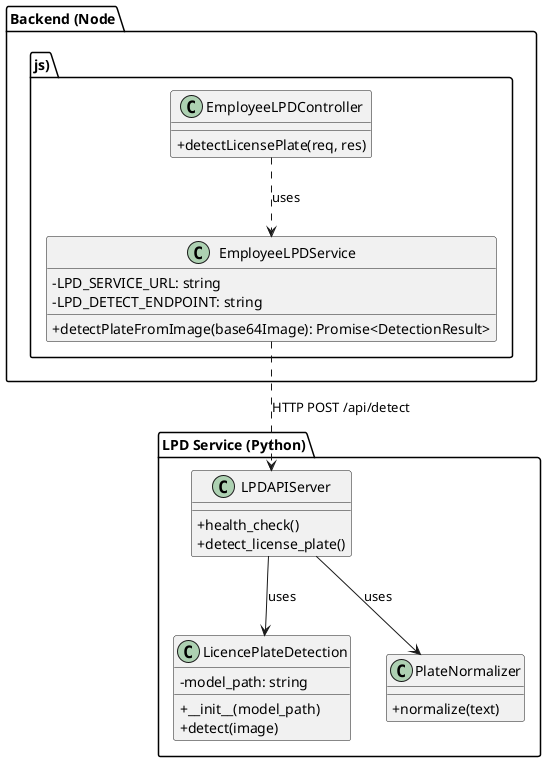
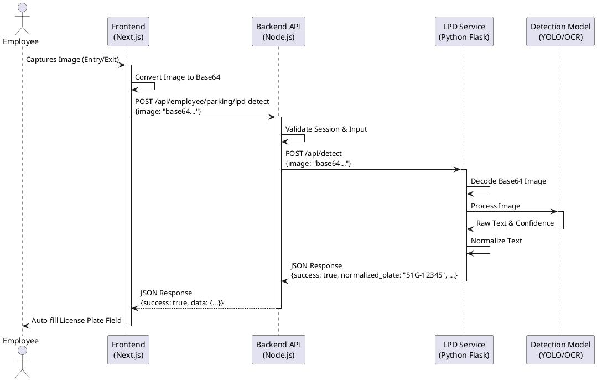

# License Plate Detection (LPD) Integration Guide

This document outlines the integration architecture for the License Plate Detection system within the Parking Lot Management application. It details the interaction between the Node.js Backend and the Python LPD Service.

## Overview

The License Plate Detection feature allows employees to automatically capture and recognize vehicle license plates during entry and exit procedures. The system uses a microservices architecture where the heavy lifting of image processing and OCR is offloaded to a dedicated Python service.

### Architecture Components

1.  **Frontend (Next.js):** Captures video frames from the client device and sends them to the backend.
2.  **Backend (Node.js/Express):** Acts as an API gateway, handling authentication, validation, and forwarding requests to the LPD service.
3.  **LPD Service (Python/Flask):** A standalone service that hosts the detection models (YOLO/OCR) and exposes a REST API for plate recognition.

## Class Diagram

The following class diagram illustrates the key classes involved in the LPD integration across the Backend and Python Service.



### Class Descriptions

-   **EmployeeLPDController:** Handles the HTTP request from the frontend, ensures the user is authenticated as an employee, and validates the input image data.
-   **EmployeeLPDService:** Encapsulates the logic for communicating with the external Python LPD service. It handles HTTP calls, timeouts, and error transformation.
-   **LPDAPIServer:** A Flask application that serves as the entry point for the Python service. It exposes endpoints for health checks and detection.
-   **LicencePlateDetection:** The core logic class that loads the AI models and processes images to extract text.
-   **PlateNormalizer:** A utility class responsible for cleaning up raw OCR text into a standardized license plate format (e.g., removing special characters, correcting common OCR errors).

## Sequence Diagram

The sequence diagram below demonstrates the flow of data from the user's action to the final detection result.



### Process Flow

1.  **Capture:** The employee triggers the camera capture on the frontend.
2.  **Transmission:** The image is converted to a Base64 string and sent to the Backend API endpoint `/parking/lpd-detect`.
3.  **Proxy:** The Backend validates the request and proxies it to the internal LPD Service URL (default: `http://localhost:8000`).
4.  **Detection:** The Python service receives the image, runs it through the detection model, and normalizes the result.
5.  **Response:** The result (plate number and confidence) is returned up the chain to the frontend, where it automatically populates the input form.

## API Reference

### Backend Endpoint

**POST** `/api/employee/parking/lpd-detect`

-   **Headers:** `Authorization: Bearer <token>`
-   **Body:**
    ```json
    {
      "image": "data:image/jpeg;base64,/9j/4AAQSkZJRg..."
    }
    ```
-   **Response:**
    ```json
    {
      "success": true,
      "data": {
        "success": true,
        "normalized_plate": "59C-123.45",
        "raw_text": "59C12345",
        "confidence": 0.98
      }
    }
    ```

### LPD Service Endpoint

**POST** `/api/detect`

-   **Body:**
    ```json
    {
      "image": "base64_string_without_header"
    }
    ```
-   **Response:**
    ```json
    {
      "success": true,
      "normalized_plate": "59C-123.45",
      "raw_text": "59C12345",
      "confidence": 0.98,
      "detection_time_ms": 150
    }
    ```
