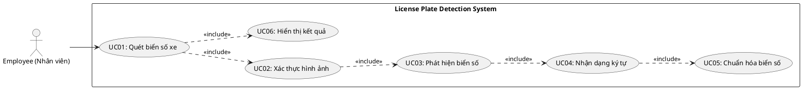
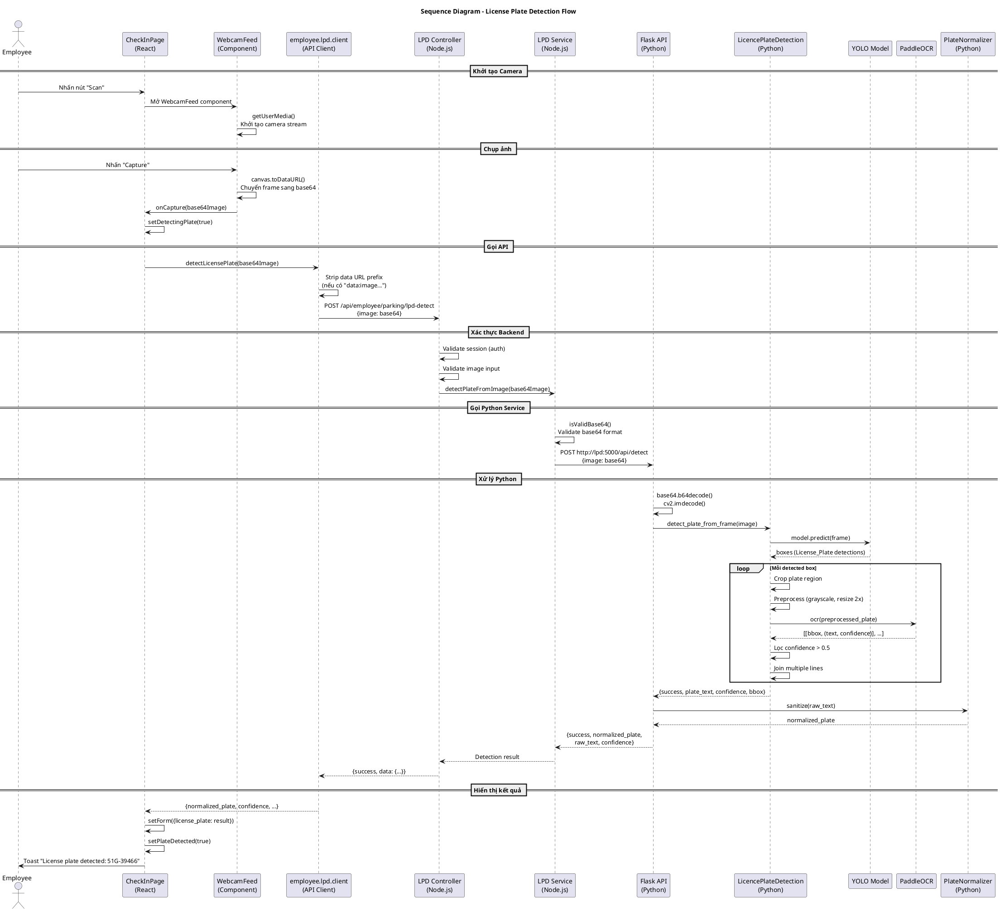
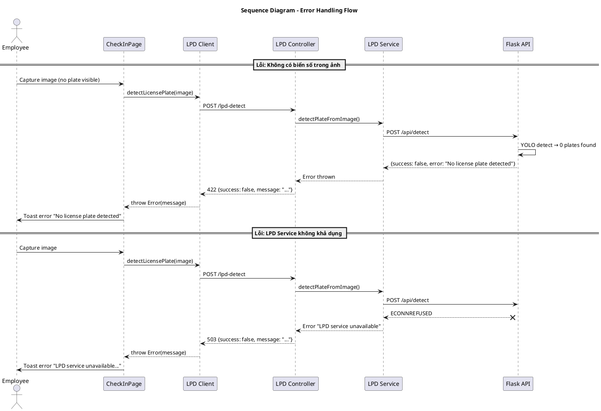
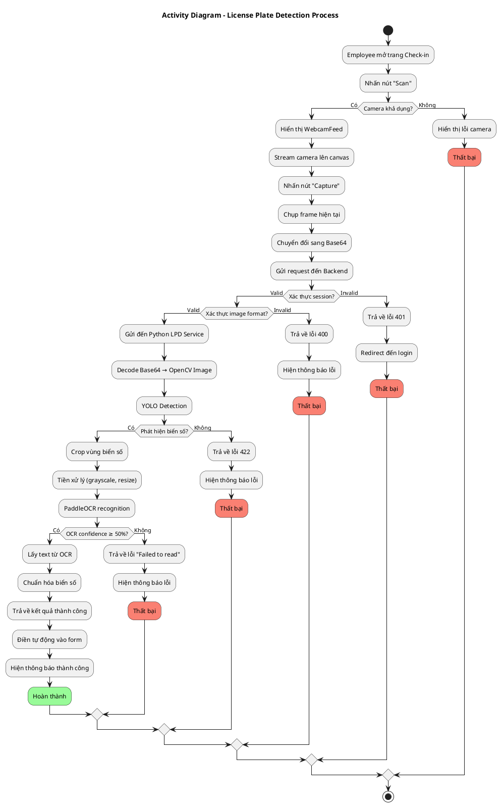
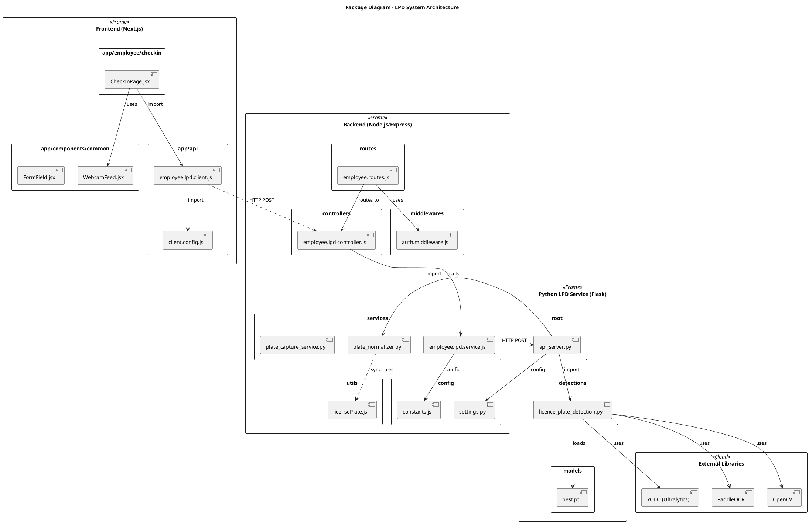
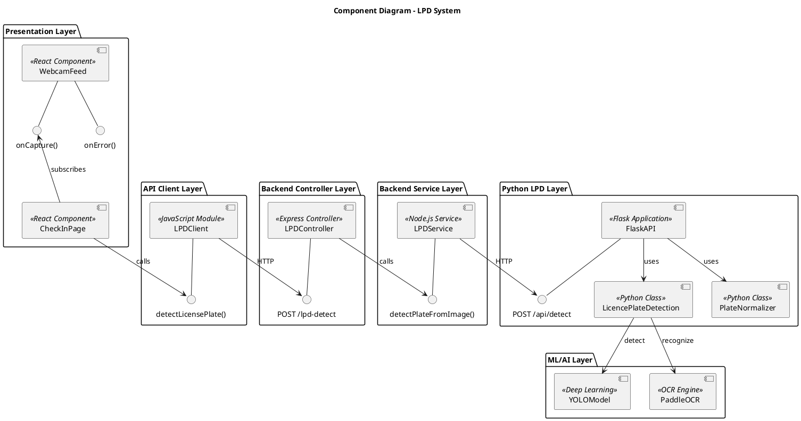
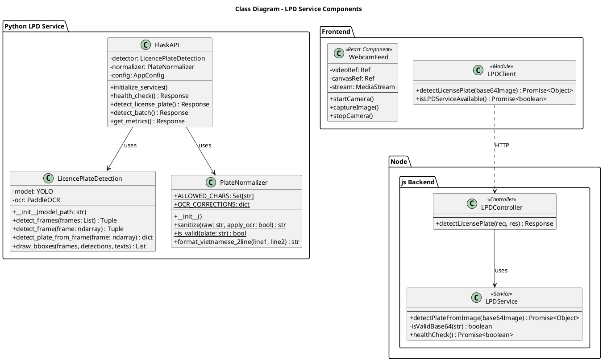
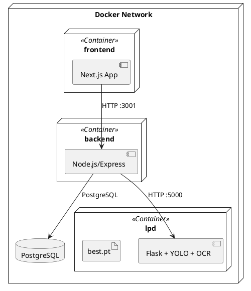

# Báo cáo Hệ thống Nhận dạng Biển số xe (License Plate Detection - LPD)

## 1. Tổng quan hệ thống

### 1.1 Mô tả
Hệ thống **License Plate Detection (LPD)** là một module tích hợp trong ứng dụng quản lý bãi đỗ xe, cho phép tự động nhận dạng biển số xe từ hình ảnh camera. Hệ thống sử dụng công nghệ Deep Learning (YOLO) để phát hiện biển số và OCR (PaddleOCR) để đọc ký tự trên biển.

### 1.2 Kiến trúc tổng quan

```
┌─────────────────┐    ┌─────────────────┐    ┌─────────────────────────────┐
│   Frontend      │───▶│    Backend      │───▶│   Python LPD Service        │
│   (React/Next)  │    │   (Node.js)     │    │   (Flask + YOLO + OCR)      │
└─────────────────┘    └─────────────────┘    └─────────────────────────────┘
```

### 1.3 Công nghệ sử dụng

| Layer | Công nghệ |
|-------|-----------|
| Frontend | React, Next.js, WebRTC (getUserMedia) |
| Backend | Node.js, Express.js, Axios |
| LPD Service | Python, Flask, YOLO (Ultralytics), PaddleOCR |
| Model | YOLO-based custom trained model (best.pt) |

---

## 2. Use Case Diagram



---

## 3. Đặc tả chi tiết Use Case

### UC01: Quét biển số xe (Scan License Plate)

| Thuộc tính | Mô tả |
|------------|-------|
| **Tên UC** | Quét biển số xe |
| **Actor** | Nhân viên (Employee) |
| **Mô tả** | Cho phép nhân viên sử dụng camera để chụp và nhận dạng tự động biển số xe |
| **Tiền điều kiện** | - Nhân viên đã đăng nhập vào hệ thống<br>- Camera được kết nối và hoạt động |
| **Hậu điều kiện** | - Biển số xe được nhận dạng và hiển thị trên form |

**Luồng chính (Main Flow):**

| Bước | Actor | Hệ thống |
|------|-------|----------|
| 1 | Nhấn nút "Scan" trên trang Check-in | |
| 2 | | Mở camera và hiển thị WebcamFeed |
| 3 | Đưa xe vào khung hình và nhấn "Capture" | |
| 4 | | Chụp ảnh từ camera, chuyển sang base64 |
| 5 | | Gửi ảnh đến Backend API |
| 6 | | Backend xác thực và chuyển tiếp đến Python LPD Service |
| 7 | | LPD Service phát hiện biển số bằng YOLO |
| 8 | | OCR đọc ký tự trên biển số |
| 9 | | Chuẩn hóa biển số (PlateNormalizer) |
| 10 | | Trả về kết quả cho Frontend |
| 11 | | Hiển thị biển số trên form, hiện thông báo thành công |

**Luồng thay thế (Alternative Flows):**

| Nhánh | Điều kiện | Xử lý |
|-------|-----------|-------|
| 3a | Camera không khả dụng | Hiển thị thông báo lỗi, cho phép nhập thủ công |
| 7a | Không phát hiện biển số trong ảnh | Trả về lỗi 422, hiển thị "No license plate detected" |
| 8a | OCR không đọc được ký tự | Trả về lỗi "Failed to read plate text" |
| 8b | Độ tin cậy OCR < 50% | Bỏ qua kết quả, thử lại hoặc báo lỗi |

---

### UC02: Xác thực hình ảnh (Validate Image)

| Thuộc tính | Mô tả |
|------------|-------|
| **Tên UC** | Xác thực hình ảnh |
| **Actor** | Hệ thống (System) |
| **Mô tả** | Kiểm tra tính hợp lệ của dữ liệu hình ảnh base64 |
| **Tiền điều kiện** | Nhận được request chứa dữ liệu image |

**Chi tiết xác thực:**

| Kiểm tra | Mô tả | HTTP Code nếu lỗi |
|----------|-------|-------------------|
| Null/Empty check | Image không được rỗng | 400 |
| Type check | Image phải là string | 400 |
| Base64 format | Kiểm tra định dạng base64 hợp lệ | 400 |
| Buffer decode | Có thể decode thành buffer | 400 |
| Image decode | OpenCV có thể decode thành ảnh | 400 |

---

### UC03: Phát hiện biển số (Detect Plate)

| Thuộc tính | Mô tả |
|------------|-------|
| **Tên UC** | Phát hiện biển số |
| **Actor** | LPD Service |
| **Mô tả** | Sử dụng YOLO model để phát hiện vị trí biển số trong ảnh |

**Chi tiết xử lý:**

```
1. Load ảnh vào memory (numpy array)
2. Chạy YOLO predict trên ảnh
3. Lọc các box có class = "License_Plate"
4. Chọn box có confidence cao nhất
5. Crop vùng biển số từ ảnh gốc
```

---

### UC04: Nhận dạng ký tự (OCR Recognition)

| Thuộc tính | Mô tả |
|------------|-------|
| **Tên UC** | Nhận dạng ký tự |
| **Actor** | PaddleOCR Engine |
| **Mô tả** | Đọc ký tự từ vùng biển số đã crop |

**Tiền xử lý ảnh:**

```
1. Chuyển sang grayscale (cv2.cvtColor)
2. Resize 2x để cải thiện OCR
3. Chuyển lại sang BGR cho PaddleOCR
```

**Cấu hình OCR:**

| Tham số | Giá trị |
|---------|---------|
| use_angle_cls | True |
| lang | 'en' |
| use_gpu | False |
| enable_mkldnn | True |
| cpu_threads | 2 |

---

### UC05: Chuẩn hóa biển số (Normalize Plate)

| Thuộc tính | Mô tả |
|------------|-------|
| **Tên UC** | Chuẩn hóa biển số |
| **Actor** | PlateNormalizer |
| **Mô tả** | Chuyển đổi raw text từ OCR thành định dạng biển số chuẩn |

**Quy tắc chuẩn hóa:**

| Bước | Xử lý | Ví dụ |
|------|-------|-------|
| 1 | Uppercase | "51g-39466" → "51G-39466" |
| 2 | OCR Corrections | O→0, I→1, Z→2, S→5, B→8 |
| 3 | Remove invalid chars | Chỉ giữ A-Z, 0-9, - |
| 4 | Collapse hyphens | "51G--39466" → "51G-39466" |
| 5 | Trim hyphens | "-51G-39466-" → "51G-39466" |

---

## 4. Sequence Diagram

### 4.1 Sequence Diagram - Luồng nhận dạng biển số



### 4.2 Sequence Diagram - Xử lý lỗi



---

## 5. Activity Diagram



---

## 6. Package Diagram



---

## 7. Component Diagram



---

## 8. Class Diagram



---

## 9. Data Flow

### 9.1 Request Flow

```
┌──────────────┐   Base64 Image   ┌───────────────┐   Base64 Image   ┌─────────────────┐
│   Frontend   │ ───────────────▶ │    Backend    │ ───────────────▶ │  Python Service │
│  (React)     │                  │  (Node.js)    │                  │    (Flask)      │
└──────────────┘                  └───────────────┘                  └─────────────────┘
                                                                              │
                                                                              ▼
                                                                     ┌─────────────────┐
                                                                     │  YOLO + OCR     │
                                                                     │  Processing     │
                                                                     └─────────────────┘
```

### 9.2 Response Data Structure

```json
{
    "success": true,
    "normalized_plate": "51G-39466",
    "raw_text": "51G-394.66",
    "confidence": 0.95,
    "detection_time_ms": 125
}
```

---

## 10. API Endpoints

### 10.1 Backend API

| Method | Endpoint | Mô tả |
|--------|----------|-------|
| POST | `/api/employee/parking/lpd-detect` | Nhận dạng biển số từ ảnh base64 |

**Request Body:**
```json
{
    "image": "<base64_encoded_image>"
}
```

**Response (Success - 200):**
```json
{
    "success": true,
    "data": {
        "success": true,
        "normalized_plate": "51G-39466",
        "raw_text": "51G-394.66",
        "confidence": 0.95
    }
}
```

### 10.2 Python LPD API

| Method | Endpoint | Mô tả |
|--------|----------|-------|
| GET | `/health` | Health check |
| POST | `/api/detect` | Phát hiện biển số đơn |
| POST | `/api/detect-batch` | Phát hiện biển số hàng loạt (max 10) |
| GET | `/api/metrics` | Thống kê service (memory, CPU) |
| GET | `/api/config` | Cấu hình service |

---

## 11. Error Codes

| HTTP Code | Lỗi | Mô tả |
|-----------|-----|-------|
| 400 | Bad Request | Image không hợp lệ, base64 sai định dạng |
| 401 | Unauthorized | Chưa đăng nhập |
| 422 | Unprocessable Entity | Không phát hiện biển số trong ảnh |
| 500 | Internal Server Error | Lỗi xử lý nội bộ |
| 503 | Service Unavailable | Python LPD service không khả dụng |
| 504 | Gateway Timeout | Request timeout |

---

## 12. Cấu hình hệ thống

### 12.1 Environment Variables

| Variable | Default | Mô tả |
|----------|---------|-------|
| LPD_SERVICE_URL | http://lpd:5000 | URL của Python LPD service |
| LPD_DETECT_ENDPOINT | /api/detect | Endpoint detection |
| LPD_TIMEOUT_MS | 30000 | Timeout cho request |
| LPD_API_PORT | 5000 | Port của Flask API |
| LPD_API_HOST | 0.0.0.0 | Host của Flask API |

### 12.2 Model Configuration

| Tham số | Giá trị |
|---------|---------|
| YOLO Model | best.pt (custom trained) |
| OCR Engine | PaddleOCR (lang='en') |
| OCR Confidence Threshold | 0.5 (50%) |

---

## 13. Deployment Architecture



---

## 14. Kết luận

Hệ thống License Plate Detection được thiết kế theo kiến trúc microservices với 3 layer chính:

1. **Frontend Layer**: React/Next.js với WebcamFeed component xử lý camera
2. **Backend Layer**: Node.js/Express đóng vai trò API Gateway và validation
3. **LPD Service Layer**: Python Flask với YOLO và PaddleOCR xử lý AI/ML

**Ưu điểm của thiết kế:**
- Tách biệt rõ ràng giữa các layer
- Dễ dàng scale từng component độc lập
- Hỗ trợ biển số Việt Nam (2 dòng)
- Có cơ chế OCR correction tự động
- Xử lý lỗi đầy đủ ở mọi layer

**Điểm cần cải thiện:**
- Thêm caching cho kết quả detection
- Hỗ trợ GPU để tăng tốc xử lý
- Queue system cho batch processing lớn

---

*Tài liệu được tạo tự động - Ngày: 2026-01-11*
